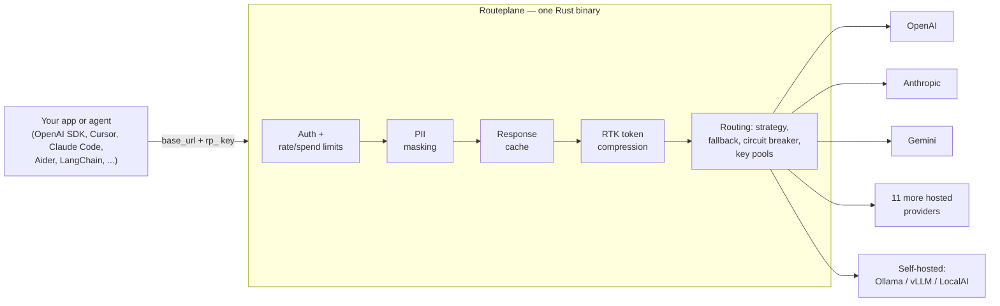
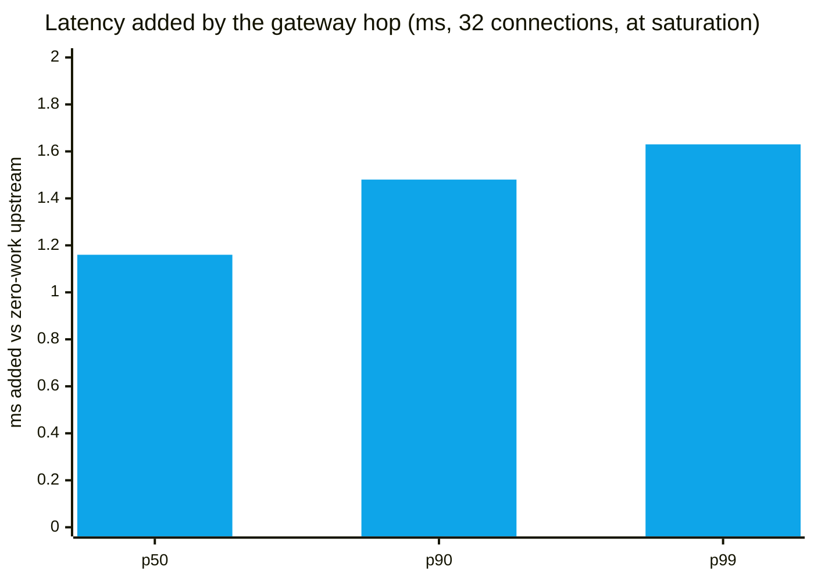

# Routeplane

**The open-source AI gateway that saves you tokens today and passes your CISO audit tomorrow.**

Routeplane is a drop-in, OpenAI-compatible gateway in a single Rust binary. Point any OpenAI SDK
or tool at it by changing only the base URL and the key, and you get 15 provider adapters
(hosted and self-hosted), fallback chains with per-provider circuit breakers, response caching,
rate and spend limits, and RTK token compression — which cut tool-message tokens by ~76% on our
benchmark suite (measured, committed, reproducible: `cd benchmarks && cargo run --release -p rtk-eval`).
Lock-free hot path with **+1.16 ms p50 / +1.63 ms p99 measured gateway overhead**
([release run, raw output committed](benchmarks/perf/RESULTS.md)). No database. No telemetry.
Apache-2.0.

[](https://github.com/routeplane-core/routeplane-ce/actions/workflows/ci.yml)
[](https://github.com/routeplane-core/routeplane-ce/blob/main/LICENSE)
[](https://github.com/routeplane-core/routeplane-ce/releases)
[](https://ghcr.io/routeplane-core/routeplane-ce)
[](https://github.com/routeplane-core/routeplane-ce/blob/main/benchmarks/perf/RESULTS.md)
[](https://github.com/routeplane-core/routeplane-ce/blob/main/benchmarks/perf/RESULTS.md)
[](https://github.com/routeplane-core/routeplane-ce/blob/main/benchmarks/perf/RESULTS.md)
[](https://github.com/routeplane-core/routeplane-ce/pkgs/container/routeplane-ce)
[](https://www.npmjs.com/package/@routeplane/sdk)
[](https://www.npmjs.com/package/@routeplane/cli)
[](https://pypi.org/project/routeplane/)


*A real, unedited terminal session: `docker compose up -d` → a stock OpenAI SDK fronting a
**local Ollama model** → the same coding-agent request measured by the model server at
**3,766 prompt tokens without RTK, 501 with it (−87%)**. Reproduce it yourself:
[docs/demo/](https://github.com/routeplane-core/routeplane-ce/tree/main/docs/demo).*

---

## Why Routeplane

- **Your token bill is mostly repeated tool output.** Coding agents re-send `git diff`, file
  reads, and build logs on every turn. → RTK compresses tool-role messages with deterministic
  filters before they reach the provider — measured ~76% tool-message token reduction on our
  benchmark suite ([reproduce it](#rtk-token-compression-the-numbers)).
- **One provider outage takes your app down.** → Fallback chains, retries, hedged requests, and
  a lock-free per-provider circuit breaker keep requests flowing to whoever is up.
- **Every provider has its own SDK, auth, and wire format.** → One OpenAI-compatible endpoint in
  front of 15 adapters. Switch providers by changing a header or a combo definition — never
  application code.
- **You want local models in the same pipeline as cloud ones.** → The self-hosted adapter makes
  Ollama, vLLM, or LocalAI a first-class provider: `self_hosted,openai` is a local-first,
  cloud-fallback chain in one header.
- **Compliance requirements grow faster than your stack.** → Start on CE; when you need
  residency-locked routing, signed audit evidence, or an MCP security gateway for agents, the
  same wire surface upgrades to [Enterprise](https://routeplane.ai) — no client rewrite.

## How it works



The hot path is lock-free end to end: circuit breakers and latency tracking are atomics, not
mutexes, so health bookkeeping never serializes your traffic.

## Requirements

- **Docker Engine 20.10+** with the **Docker Compose v2 plugin** — invoked as `docker compose`
  (space), not the legacy `docker-compose`. Check with `docker compose version` (needs ≥ 2.24).
- **Registry access.** `docker compose up` needs to reach a container registry:
  - Pulling the pre-built image → `ghcr.io`.
  - Building from source (below) → Docker Hub (`registry-1.docker.io`) for the base images.
  - Behind a corporate proxy or VPN? Configure it in **Docker Desktop → Settings → Resources →
    Proxies**, or you'll see `TLS handshake timeout` / `http: server gave HTTP response to HTTPS
    client` on the base-image pull.
- **Windows / WSL 2:** enable **Docker Desktop → Settings → Resources → WSL Integration** for your
  distro (then Apply & Restart), or `docker` won't be reachable from your shell.
- **Building from source** (optional — `docker compose up --build`): give Docker
  **~4 GB RAM and ~5 GB disk**; the first build compiles the Rust workspace (~10–15 min). The
  default pull needs neither.
- **Apple Silicon:** the image is `linux/amd64` for now and runs under Rosetta emulation; a native
  `arm64` image is on the roadmap.

## Quickstart

### Fastest start (one command)

No clone, no config files — pull the published image and hand it a minimal key registry inline:

```bash
docker run -d -p 8080:8080 \
  -e OPENAI_API_KEY=sk-your-key \
  -e RP_KEYS_JSON='{"keys":[{"name":"default","routeplane_key":"rp_local_dev","provider_keys":{"openai":"env:OPENAI_API_KEY"}}]}' \
  ghcr.io/routeplane-core/routeplane-ce:latest
```

That's it. Chat completions at `http://localhost:8080/v1/chat/completions` (send
`Authorization: Bearer rp_local_dev`), and the bundled web console at `http://localhost:8080`.
`RP_KEYS_JSON` supplies the gateway's key registry without a file mount — the registry is
fail-closed, so a bare `docker run` with no key registry will refuse to start. Swap
`rp_local_dev` for your own `rp_` key (`echo "rp_$(openssl rand -hex 24)"`) before you expose the
gateway to anything.

### Full setup (clone + config)

Docker only — no Rust toolchain needed. Three commands to a running gateway:

```bash
git clone https://github.com/routeplane-core/routeplane-ce.git && cd routeplane-ce
cp .env.example .env && cp configs/keys.example.json configs/keys.json
docker compose up -d
```

**Prefer a CLI to `curl`?** Once the gateway is up, drive it from the Routeplane CLI:

```bash
npx @routeplane/cli init          # point it at http://localhost:8080
rp chat "hello" --provider groq
```

> **`docker compose up` pulls the pre-built image** — a few seconds, no Rust toolchain. To build
> from source instead, run `docker compose up --build` (~10–15 min the first time); see
> [Requirements](#requirements) for the resources that path needs.

Between steps 2 and 3: put at least one provider key in `.env` (e.g. `OPENAI_API_KEY=sk-...`),
and set your own gateway key in `configs/keys.json` — any string starting with `rp_`. Generate a
strong one with `echo "rp_$(openssl rand -hex 24)"`. Provider keys stay server-side in `.env`;
clients only ever hold the `rp_` key.

Call it with curl (`RP_KEY` is the gateway key you set in `keys.json`):

```bash
export RP_KEY=rp_your_key
curl http://localhost:8080/v1/chat/completions \
  -H "Authorization: Bearer $RP_KEY" \
  -H "Content-Type: application/json" \
  -d '{"model":"gpt-4o-mini","messages":[{"role":"user","content":"hello"}]}'
```

Or with the stock OpenAI SDK — no Routeplane-specific code:

```python
from openai import OpenAI

client = OpenAI(base_url="http://localhost:8080/v1", api_key="rp_your_key")
reply = client.chat.completions.create(
    model="gpt-4o-mini",
    messages=[{"role": "user", "content": "hello"}],
)
print(reply.choices[0].message.content)
```

### The two classic first-run failures

- **`env file .env not found`** — compose expects `.env` to exist (step 2 above creates it), even
  if you only fill in one key.
- **Gateway exits at startup complaining about `configs/keys.json`** — if that file didn't exist
  when you ran `docker compose up`, Docker silently created a *directory* at the bind-mount
  source. Fix: `docker compose down`, `rm -r configs/keys.json`, create the real file
  (`cp configs/keys.example.json configs/keys.json`), and `up` again. To avoid the mount
  entirely, inject the registry as an env var instead: `RP_KEYS_JSON` (raw or base64 JSON) or
  `RP_KEYS_FILE` (an alternate path).

For the full self-hosting walkthrough (env vars, keys, building from source, Apple Silicon
notes), see [SELF_HOST.md](https://github.com/routeplane-core/routeplane-ce/blob/main/SELF_HOST.md).

## Deploy

Deploy Routeplane CE with one click, or self-host it yourself:

[](https://portal.azure.com/#create/Microsoft.Template/uri/https%3A%2F%2Fraw.githubusercontent.com%2Frouteplane-core%2Frouteplane-ce%2Fmain%2Fdeploy%2Fazure%2Fazuredeploy.json)

<!-- The "Deploy to Azure" button loads deploy/azure/azuredeploy.json from `main` via
     raw.githubusercontent.com, so it resolves once this change is merged to main. -->

The button provisions an [Azure Container Apps](https://learn.microsoft.com/azure/container-apps/)
environment running the published image — serverless and scale-to-zero-capable. For local, VM, or
non-Azure hosting, use Docker directly:

| Method | How |
|--------|-----|
| **Azure Container Apps** | The **Deploy to Azure** button above — serverless ACA from [`deploy/azure/azuredeploy.json`](deploy/azure/azuredeploy.json) |
| **Docker (one command)** | The [`docker run` one-liner](#fastest-start-one-command) — published image, inline key registry, no clone |
| **Docker Compose** | `git clone …` then `docker compose up -d` — full config files on a local box or VM (see [Quickstart](#quickstart)) |
| **CLI** | `npx @routeplane/cli init` — a *client*, not a server; point it at a gateway you already have running |

Docker, Docker Compose, and the Azure button are the supported deployment paths today.

## SDKs, CLI & MCP Server

Routeplane is OpenAI-compatible, so the stock OpenAI SDKs already work (see above). For a
first-class experience — typed clients, a terminal UI, and gateway tools inside your AI
assistant — there are also dedicated packages:

**Python SDK** — `pip install routeplane`

```python
from routeplane import Routeplane

rp = Routeplane(api_key="rp_...", base_url="http://localhost:8080/v1")
resp = rp.chat.completions.create(
    model="gpt-4o",
    messages=[{"role": "user", "content": "Hello"}],
)
```

**TypeScript SDK** — `npm i @routeplane/sdk`

```typescript
import { Routeplane } from '@routeplane/sdk';

const rp = new Routeplane({ apiKey: 'rp_...', baseUrl: 'http://localhost:8080/v1' });
```

**CLI** — zero install with `npx`:

```bash
npx @routeplane/cli init    # point at your local gateway
rp chat "hello"             # streaming completions
rp logs --limit 20          # request logs
rp usage                    # cost dashboard
```

**MCP server** — 33 gateway tools for Claude Code, Cursor, and VS Code: send completions,
check costs, and manage providers from your AI assistant. Add it to your assistant's MCP config:

```bash
npx @routeplane/mcp-server
```

Source and full docs:
[TypeScript SDK + CLI + MCP](https://github.com/routeplane-core/routeplane-devtools) ·
[Python SDK](https://github.com/routeplane-core/routeplane-python).

## The Console

The same single binary also serves a web console on the gateway's own origin — open
`http://localhost:8080` in a browser. Create a local operator account, add an
OpenAI-compatible provider **at runtime with no restart**, try models in the playground,
and watch the traffic land in usage analytics:


*A real browser session against the real gateway and a local Ollama model — no cloud keys,
no mocks. Reproduce it (or re-record it) from
[docs/demo-console/](https://github.com/routeplane-core/routeplane-ce/tree/main/docs/demo-console).*

- **Email + password, self-contained.** Accounts live in a local file
  (`configs/console-accounts.json`, argon2id-hashed); sessions are signed tokens stored only
  in your browser. Signup is open by design — the first (usually only) operator bootstraps
  their own account on a box they control. Logout revokes every outstanding session.
- **Custom providers at runtime.** Any OpenAI-compatible endpoint (vLLM, Ollama, LocalAI, a
  cloud service) — its models appear in `/v1/models` and the playground immediately.
  Upstream keys are write-only: stored server-side with `0600` permissions, echoed back only
  as `…last4`.
- **Your gateway key, one click away.** The console reveals the `rp_` key its session
  authorizes as, ready to paste into an SDK — the browser never needs it to use the console
  itself.

The console is on when `RP_CONSOLE_DIR` points at the built SPA — the published Docker image
sets it, so `docker compose up` includes it out of the box. Pointing a custom provider at a
loopback or private-network address (like local Ollama) is an explicit opt-in:
`RP_CUSTOM_PROVIDER_ALLOW_PRIVATE=on`. Link-local/cloud-metadata addresses are always
refused — that guard has no off switch.

## Works with your tools

Anything that speaks the OpenAI API works unchanged — the integration is always the same two
settings: **base URL → your gateway, key → your `rp_` key.** Zero code changes.

| Client | How to point it at Routeplane |
|--------|-------------------------------|
| OpenAI Python SDK | `OpenAI(base_url="http://localhost:8080/v1", api_key="rp_...")` |
| OpenAI Node SDK | `new OpenAI({ baseURL: "http://localhost:8080/v1", apiKey: "rp_..." })` |
| Routeplane Python SDK | `pip install routeplane` — typed first-party client |
| Routeplane TypeScript SDK | `npm i @routeplane/sdk` — typed first-party client |
| Routeplane CLI | `npx @routeplane/cli` — chat, logs, and usage from the terminal |
| Routeplane MCP server | `npx @routeplane/mcp-server` — 33 gateway tools for AI assistants |
| Cursor | Override the OpenAI base URL in model settings, paste your `rp_` key |
| Claude Code | Point its Anthropic base URL at the gateway — Routeplane also accepts Anthropic-style `/v1/messages` inbound |
| Cline | Add an OpenAI-compatible provider with the gateway URL + `rp_` key |
| Continue | Add an `openai`-provider model with `apiBase` set to the gateway |
| Aider | `OPENAI_API_BASE=http://localhost:8080/v1 OPENAI_API_KEY=rp_...` |
| LangChain | `ChatOpenAI(base_url=..., api_key="rp_...")` |
| LlamaIndex | `OpenAI(api_base=..., api_key="rp_...")` |
| Anything else OpenAI-compatible | Same two settings |

The API surface: `/v1/chat/completions` (buffered and SSE streaming), `/v1/embeddings`,
`/v1/models` (lists providers **and your named combos**, so combos appear in model-picker
dropdowns), `/v1/moderations`, `/v1/rerank`, `/v1/audio/speech`, plus the Anthropic-style
`/v1/messages` inbound surface.

## Providers

15 adapters. Route with `x-routeplane-provider`, a comma-separated fallback chain, or a
[named combo](#named-combos). Each adapter translates the OpenAI wire shape to the provider's
native API where they differ (Anthropic's `/v1/messages`, Gemini's `generateContent`) and speaks
the dialect directly where they don't.

| Provider | Wire name | Notes |
|----------|-----------|-------|
| OpenAI | `openai` | Default when no provider is specified |
| Anthropic | `anthropic` | Native `/v1/messages` translation |
| Google Gemini | `gemini` | Native `generateContent` translation |
| Azure OpenAI | `azure_openai` | Endpoint/deployment set via env |
| AWS Bedrock | `bedrock` | |
| Mistral | `mistral` | |
| Cohere | `cohere` | |
| Groq | `groq` | |
| DeepSeek | `deepseek` | |
| Together AI | `together` | ~100+ open-weight models |
| Fireworks AI | `fireworks` | |
| xAI (Grok) | `xai` | |
| OpenRouter | `openrouter` | Meta-aggregator: one key, hundreds of models |
| Self-hosted / local | `self_hosted` | Any OpenAI-compatible server — Ollama, vLLM, LocalAI, LM Studio, TGI. Set `SELF_HOSTED_BASE_URL` to the server root **without** `/v1` (e.g. `http://ollama:11434` — the gateway appends `/v1/chat/completions` itself) |

`self_hosted` is a first-class provider — it participates in fallback chains, combos,
strategies, and circuit breaking exactly like a hosted provider, so `self_hosted,openai`
(local first, cloud fallback) is a one-header setup.

## Features

Everything below ships in this repo under Apache-2.0 and runs on a single node with no external
dependencies — no Redis, no database, no cloud account.

| Capability | What it does |
|------------|--------------|
| **RTK token compression** | Deterministic filters shrink verbose tool output (`git diff`, file reads, build logs) before it reaches the provider. [Measured numbers below.](#rtk-token-compression-the-numbers) |
| **Routing strategies** | `priority`, `weighted`, `cost`, `latency` — per request (header) or per combo |
| **Fallback + retries + hedging** | Comma-separated provider chains, status-aware retries, hedged requests; first success wins |
| **Circuit breaker + latency EWMA** | Per-provider, lock-free (atomics only); open circuits are skipped, EWMAs feed the `latency` strategy |
| **Named combos** | Operator-defined routing chains addressable via the `model` field; listed in `/v1/models` |
| **Multi-account key pools** | Several upstream keys per provider with per-key cooldown failover on rate-limit/auth errors |
| **Response cache** | Exact-match, in-process, single-node |
| **Rate + spend limits** | Per key / tenant / model: requests/min, tokens/min, daily and monthly budgets |
| **PII masking (basic)** | Regex-grade masking of common personal-data patterns, inbound and outbound |
| **Analytics + request logs** | In-memory, queryable over the API; nothing written to disk or sent anywhere |
| **Auth** | `rp_`-prefixed virtual keys, as `Authorization: Bearer` (what OpenAI SDKs send) or `x-routeplane-api-key` |
| **Web console** | Bundled SPA served by the gateway itself — email/password login, playground, usage, key reveal. [See it in action.](#the-console) |
| **Runtime custom providers** | Add any OpenAI-compatible endpoint from the console — usable immediately, no restart; keys stored write-only |

### Named combos

A combo is a saved routing chain with a public name. Clients address it as a model — no custom
headers, no SDK changes — and it shows up in `/v1/models`, so it works from model-picker
dropdowns. Defined in `configs/routing-policies.json`:

```json
{"configs": [{"id": "cfg_fast", "combo": "fast",
  "routing": {"strategy": "cost", "targets": [
    {"provider": "groq",   "params": {"override": {"model": "llama-3.3-70b-versatile"}}},
    {"provider": "openai", "params": {"override": {"model": "gpt-4o-mini"}}}]}}]}
```

Now `{"model": "fast", ...}` routes to Groq by cost and falls back to OpenAI. Every combo target
pins a concrete model, so the combo name never leaks to a provider.

### Multi-account key pools

A `provider_keys` value that contains commas is a pool. Each element resolves independently
(literal or `env:`-referenced); on a rate-limit or auth failure the gateway fails over to the
next key, tracking cooldown per key:

```json
{"provider_keys": {"openai": "env:OPENAI_KEY_A,env:OPENAI_KEY_B"}}
```

A single-value entry behaves exactly as before — the pool machinery only engages when there is a
comma.

### Fallback and circuit breaking

Give a chain (`x-routeplane-provider: openai,anthropic` or a combo) and the gateway orders
candidates by your chosen strategy, skips providers whose circuit is open, and tries them in
order — first success wins. On streaming requests, fallback applies until the first chunk
arrives; after that the gateway is committed to that provider.

## Performance: measured, not promised

Every number below comes from the [committed harness](benchmarks/perf/) run on a dedicated,
otherwise-idle Azure `Standard_D8s_v5` (a VM anyone can rent), against the exact tree that
ships as `v0.1.0-rc.1` — with the raw load-generator output
[committed alongside](benchmarks/perf/results/2026-07-04-azure-d8s-v5/). One command reproduces it.



| Measured (median of 3 runs) | Value |
|---|---|
| Gateway overhead @ 32 connections | **+1.16 ms p50 · +1.48 ms p90 · +1.63 ms p99** |
| Sustained throughput (100% success) | **~24,000 req/s** on 8 shared vCPUs |
| Memory | **24.5 MiB** RSS idle → **~90 MiB** at 24k req/s |
| Ship size | **13.6 MiB** binary · **36 MiB** compressed image |

The honest fine print — stated because most gateway numbers you read omit it: this was measured
**at the gateway's saturation ceiling**, with the load generator and mock upstream sharing the
same 8 vCPUs, and **default per-request logging switched on** (it wrote 6.8 GB during the run —
that cost is included, because it's what ships). Vendor numbers measured below saturation with
observability off would look flatter; ours is the worst-case read. Full methodology, hardware
disclosure, saturation analysis, and caveats: [benchmarks/perf/RESULTS.md](benchmarks/perf/RESULTS.md).

```bash
cd benchmarks/perf && ./run.sh floor && ./run.sh gateway rp_YOUR_KEY   # reproduce it
```

## RTK token compression: the numbers

Coding agents burn most of their input tokens re-sending tool output. RTK detects the shape of
`tool`-role message content and applies one of 11 deterministic filters (git-diff, git-status,
grep, find, ls, tree, dedup-log, smart-truncate, numbered-file-read, search-list, build-output) —
collapsing unchanged diff context, deduplicating repeated log lines, pruning deep listings while
keeping heads, tails, and errors.

Measured on our benchmark suite — a committed, sha256-pinned corpus of 24 coding-agent
conversations, tokenized with tiktoken (o200k_base). Reproduce it yourself:
`cd benchmarks && cargo run --release -p rtk-eval`.

| Measurement (o200k_base) | Reduction |
|--------------------------|----------:|
| Tool-message tokens, corpus aggregate | **~76%** |
| Realistic mixed multi-tool debugging session | **~31%** |
| Per-trace median (p50) | **56%** |
| Large single file reads (best case) | up to ~98% |
| Small/unrecognized outputs (fail-safe passthrough) | 0% |

Full methodology, per-filter and per-trace breakdowns:
[benchmarks/rtk-eval/RESULTS.md](https://github.com/routeplane-core/routeplane-ce/blob/main/benchmarks/rtk-eval/RESULTS.md).
The harness replays the exact hot-path transform the gateway applies, fail-safes included, and
the eval is deterministic — same corpus in, same report out. Our rule: the collateral adjusts to
the measured numbers, never the reverse.

The honest fine print:

- **These are input-token reductions, not a quality guarantee.** The percentages count tokens
  removed, not a promise your agent's output is unchanged — and tool-output compression bites
  hardest on the workload most sensitive to it, code editing. Treat the number as potential
  savings to *verify on your own traffic*, not a free lunch: keep RTK on where quality holds,
  opt a key out where it doesn't (below). Request-time quality checking with in-request repair —
  keeping the savings only when the response still holds up — is the
  [Enterprise](https://routeplane.ai) layer; CE ships the fast deterministic engine and the
  reproducible numbers to judge it for yourself.
- **It's deterministic filtering, not summarization** — pure string processing, no ML, no
  network calls, well under a millisecond added.
- **It's fail-safe**: unrecognized content passes through untouched, output is never empty, and
  a request never grows.
- **It only helps tool-heavy workloads.** The aggregate is dominated by large file reads; a
  mixed session lands near ~31%, and requests with no tool output see ~0%.
- **It's lossy by design**: what gets dropped is repeated/unchanged filler in tool output. If a
  tool in your pipeline re-reads exact bytes from a prior result, opt that key out with
  `"rollout_holdbacks": ["token_compression"]` in `configs/keys.json`. RTK is on by default in CE.

A gateway latency/throughput harness also lives in
[benchmarks/perf](https://github.com/routeplane-core/routeplane-ce/tree/main/benchmarks/perf) —
methodology is published; overhead numbers land with the release run on quiet hardware. We don't
publish a performance number without the harness commit that produced it.

## Verify what you run

Routeplane is maintained pseudonymously by the Routeplane team. We think the honest response to
"an anonymous team wants to proxy my API keys" is: **don't trust the author — verify the
artifact.** Every claim below is checkable without taking our word for it.

- **Signed images.** Every GHCR image is signed with cosign (keyless, GitHub OIDC). Verify before
  you run:

  ```bash
  cosign verify ghcr.io/routeplane-core/routeplane-ce:latest \
    --certificate-oidc-issuer https://token.actions.githubusercontent.com \
    --certificate-identity-regexp \
      '^https://github\.com/routeplane-core/routeplane-ce/\.github/workflows/image\.yml@refs/'
  ```

  The identity ties the signature to this repo's `image.yml` workflow — a signature from anything
  else does not verify. Both `:latest` and the immutable version tags (e.g. `:v0.1.0`) are
  signed; for a reproducible pin, verify and run a specific version or a `@sha256:` digest.

- **SBOM.** A Syft-generated SPDX SBOM is attached to every
  [GitHub release](https://github.com/routeplane-core/routeplane-ce/releases) and attested on the
  image, so you can diff exactly which crates are inside.
- **Public CI.** Images are built by the public workflows in
  [.github/workflows](https://github.com/routeplane-core/routeplane-ce/tree/main/.github/workflows)
  — the build you can read is the build that produced the artifact.
- **No telemetry, no phone-home.** CE makes outbound connections only to the providers you
  configure. No usage pings, no update checks, no crash reporting, no analytics. Grep the source.
- **Your keys stay yours.** Provider keys live server-side in your `.env`; clients hold only the
  `rp_` virtual key. The gateway never logs key material.
- **Vulnerabilities:** see
  [SECURITY.md](https://github.com/routeplane-core/routeplane-ce/blob/main/SECURITY.md) — reports
  go to `security@routeplane.ai`.

## Community Edition vs Enterprise

Routeplane is open-core. This repo is the Community Edition — a complete, production-shaped
gateway for a developer or team self-hosting, not a demo. The commercial Enterprise edition
(source not published) adds what CISOs, regulators, and multi-tenant operators require:

| Capability | CE (this repo, Apache-2.0) | Enterprise |
|------------|:--------------------------:|:----------:|
| OpenAI-compatible API + streaming + embeddings | ✅ | ✅ |
| 15 provider adapters incl. self-hosted/local | ✅ | ✅ |
| Routing strategies, fallback, retries, hedging, circuit breaker | ✅ | ✅ |
| Named combos (chains addressable via `model`) | ✅ | ✅ |
| Multi-account key pools | ✅ | ✅ |
| RTK token compression | ✅ | ✅ |
| Exact-match response cache | ✅ | ✅ |
| Rate + spend limits (basic) | ✅ | ✅ |
| PII masking (basic) + residency classifier | ✅ | ✅ |
| In-memory analytics + request logs | ✅ | ✅ |
| Inline per-request routing config (`x-routeplane-config`) | — | ✅ |
| Sovereign data-residency routing + signed hash-chained audit ledger + verifiable audit artifacts | — | ✅ |
| MCP agentic-security gateway + agent governance | — | ✅ |
| Advanced guardrails (webhook + ML threat detection) | — | ✅ |
| Semantic cache | — | ✅ |
| Versioned prompt registry | — | ✅ |
| FinOps export + durable telemetry retention | — | ✅ |
| Model-catalog governance | — | ✅ |
| Multi-tenant control plane (SSO, RBAC, key issuance) | — | ✅ |
| Multi-region cells | — | ✅ |

**The covenant: features listed as CE stay CE.** The boundary only ever moves in one direction —
toward more free. No feature that ships in this repo will be moved behind a paywall.

The enterprise/sovereign story — residency-locked routing with regulator-grade signed audit
evidence, and a security gateway for agent tool calls — lives at
[routeplane.ai](https://routeplane.ai).

## Use cases

- **Cut coding-agent bills.** Put Routeplane between Cursor/Cline/Aider and your provider; RTK
  compresses the tool output those agents re-send every turn (~76% tool-message reduction on our
  benchmark suite — [reproduce it](#rtk-token-compression-the-numbers)), and the exact-match
  cache absorbs repeats.
- **Multi-provider resilience.** `openai,anthropic,gemini` as a fallback chain with circuit
  breaking means a provider incident degrades to a different model, not an outage page.
- **Local + cloud hybrid.** Serve cheap/private traffic from Ollama or vLLM and fall back to a
  hosted frontier model — `self_hosted,openai` — with one gateway, one key, one wire format.
- **A compliance-ready base you can grow into.** Start with CE's PII masking, spend limits, and
  request logs; when the audit or residency mandate arrives, the same endpoint upgrades to
  Enterprise's signed ledger and sovereign routing without touching client code.

## Configuration

Kept short here — the full reference lives at [docs.routeplane.ai](https://docs.routeplane.ai).

### Request headers

| Header | Meaning |
|--------|---------|
| `Authorization: Bearer rp_...` | Your gateway key, OpenAI-SDK style (or use `x-routeplane-api-key`) |
| `x-routeplane-provider` | Provider or comma-separated fallback chain, e.g. `openai,anthropic` (default `openai`) |
| `x-routeplane-strategy` | Candidate ordering: `priority` (default), `weighted`, `cost`, `latency` |
| `x-routeplane-config` | Inline per-request routing config — Enterprise; in CE, use named combos instead |

### keys.json

`configs/keys.json` maps gateway keys to provider credentials. Minimal shape:

```json
{
  "keys": [
    {
      "name": "default",
      "routeplane_key": "rp_generate_your_own",
      "provider_keys": {
        "openai": "env:OPENAI_API_KEY",
        "anthropic": "env:ANTHROPIC_API_KEY",
        "groq": "env:GROQ_KEY_A,env:GROQ_KEY_B"
      }
    }
  ]
}
```

`env:` values resolve from the gateway's environment at request time; comma-separated values form
a failover pool. Optional per-key fields add `limits` (rate + budget) and `rollout_holdbacks`.
Alternatives to the file mount: `RP_KEYS_JSON` (inline JSON, raw or base64) or `RP_KEYS_FILE`
(alternate path).

### Combos and strategies

Combos live in `configs/routing-policies.json` (override the path with
`RP_ROUTING_POLICIES_FILE`) — see [Named combos](#named-combos). Strategies order the candidates
within a chain: `priority` keeps your listed order, `weighted` splits traffic, `cost` prefers
cheaper targets, `latency` prefers the fastest recent EWMA.

### Useful environment variables

| Variable | Meaning |
|----------|---------|
| `PORT` | Listen port (default `8080`) |
| `RUST_LOG` | Log filter (default `routeplane=info`) |
| `SELF_HOSTED_BASE_URL` | Root URL of your OpenAI-compatible local server, without `/v1` — e.g. `http://ollama:11434` (enables `self_hosted`) |
| `RP_KEYS_JSON` / `RP_KEYS_FILE` | Key registry without a bind mount |
| `RP_ROUTING_POLICIES_FILE` | Combos/routing-config file path |
| `RP_CONSOLE_DIR` | Path to the built console SPA; set ⇒ the gateway serves the console (the Docker image sets it) |
| `RP_CONSOLE_SESSION_SECRET` | Console session-signing secret (≥32 chars); unset ⇒ random per boot, sessions reset on restart |
| `RP_CONSOLE_ACCOUNTS_FILE` | Console account store (default `configs/console-accounts.json`) |
| `RP_CONSOLE_KEY` | Which registry key console sessions authorize as (default: the only/first key) |
| `RP_CUSTOM_PROVIDER_ALLOW_PRIVATE` | `on` ⇒ allow custom providers on loopback/private IPs (local Ollama/vLLM); link-local/metadata always refused |

## FAQ

**Is it really free?**
Yes. Everything in this repo is Apache-2.0 — commercial use, modification, and redistribution
included. No seat counts, no usage tiers, no time bombs.

**What's the catch with open-core?**
The catch is stated, not hidden: enterprise compliance and multi-tenant governance features
(sovereign routing, the signed audit ledger, the MCP security gateway, the control plane) are a
separate commercial product. The covenant above is the guarantee that the line only moves toward
more free — nothing in CE will ever be paywalled retroactively.

**Does it phone home?**
No. Zero telemetry, zero update checks, zero crash reporting. CE's only outbound connections are
to the providers you configure. It's a single binary — grep the source, or diff the SBOM.

**How is this different from LiteLLM?**
LiteLLM is an excellent, mature Python proxy with a much larger provider catalog, and if it fits
your stack you should be happy with it. Routeplane's different bets: a single Rust binary with a
lock-free hot path instead of a Python service; RTK token compression with a committed,
reproducible benchmark; no external dependencies (no Redis/DB) for single-node self-hosting; and
an upgrade path into sovereign-residency and agentic-security governance for regulated
environments. Try both against your workload — the base-URL swap makes that cheap. The full
comparison — LiteLLM, Bifrost, TensorZero, and Portkey, including what each does better than
us — is in [COMPARISON.md](https://github.com/routeplane-core/routeplane-ce/blob/main/COMPARISON.md).

**Can I use local models?**
Yes — `self_hosted` fronts any OpenAI-compatible server (Ollama, vLLM, LocalAI, LM Studio, TGI)
and participates in chains, combos, and circuit breaking like any hosted provider.

**Is RTK lossy? Will it break my agent?**
It's lossy by design — it drops repeated/unchanged filler in tool output (unchanged diff context,
duplicate log lines, the middle of huge file reads) and it's fail-safe (unrecognized content
passes through untouched). Whether it affects your agent's output depends on the workload —
code-editing tasks are the most sensitive to tool-output compression — so measure it on your own
traffic: keep it on where quality holds, and opt a key out with `rollout_holdbacks` where it
doesn't. The full behavior is measured and documented in
[benchmarks/rtk-eval/RESULTS.md](https://github.com/routeplane-core/routeplane-ce/blob/main/benchmarks/rtk-eval/RESULTS.md).

**Is it production-ready?**
The engine is production-shaped — typed Rust, a lock-free hot path, circuit breaking, timeouts,
a public CI gate with the full test suite, signed images, and SBOMs. It's also early software
from a small team with no SLA (see below): run it behind your own monitoring, pin a version, and
read the release notes. That's the honest answer.

**How do I upgrade to Enterprise?**
The wire surface is the same, so clients don't change. Start at
[routeplane.ai](https://routeplane.ai) or write to `hello@routeplane.ai`.

## Tech stack

Rust (Axum + Tokio) — one static binary, an async lock-free hot path, and a cold start fast
enough to scale to zero.

## Community and support

- **Questions and ideas:**
  [GitHub Discussions](https://github.com/routeplane-core/routeplane-ce/discussions).
- **Bugs:** [issues](https://github.com/routeplane-core/routeplane-ce/issues) — include the
  request path and a redacted log snippet.
- **Contributing:**
  [CONTRIBUTING.md](https://github.com/routeplane-core/routeplane-ce/blob/main/CONTRIBUTING.md)
  — build, test, and PR conventions. Good first issues are labeled.
- **Security:**
  [SECURITY.md](https://github.com/routeplane-core/routeplane-ce/blob/main/SECURITY.md) /
  `security@routeplane.ai`. Please don't open public issues for vulnerabilities.
- **Docs:** [docs.routeplane.ai](https://docs.routeplane.ai).
- **How it compares:** honest comparison vs LiteLLM, Bifrost, TensorZero, Portkey —
  [COMPARISON.md](https://github.com/routeplane-core/routeplane-ce/blob/main/COMPARISON.md).
- **Contact:** `maintainers@routeplane.ai`.
- **No SLA:** CE is maintained best-effort by a small team. We triage honestly and ship fixes,
  but there are no response-time guarantees. If you need an SLA, that is an
  [Enterprise](https://routeplane.ai) conversation.

### Star history

<!-- TODO(launch): embed the star-history chart once the repo is public:
[](https://star-history.com/#routeplane-core/routeplane-ce&Date)
-->

## License

[Apache-2.0](https://github.com/routeplane-core/routeplane-ce/blob/main/LICENSE). Third-party
crate licenses are listed in
[THIRD_PARTY_NOTICES](https://github.com/routeplane-core/routeplane-ce/blob/main/THIRD_PARTY_NOTICES.md).
